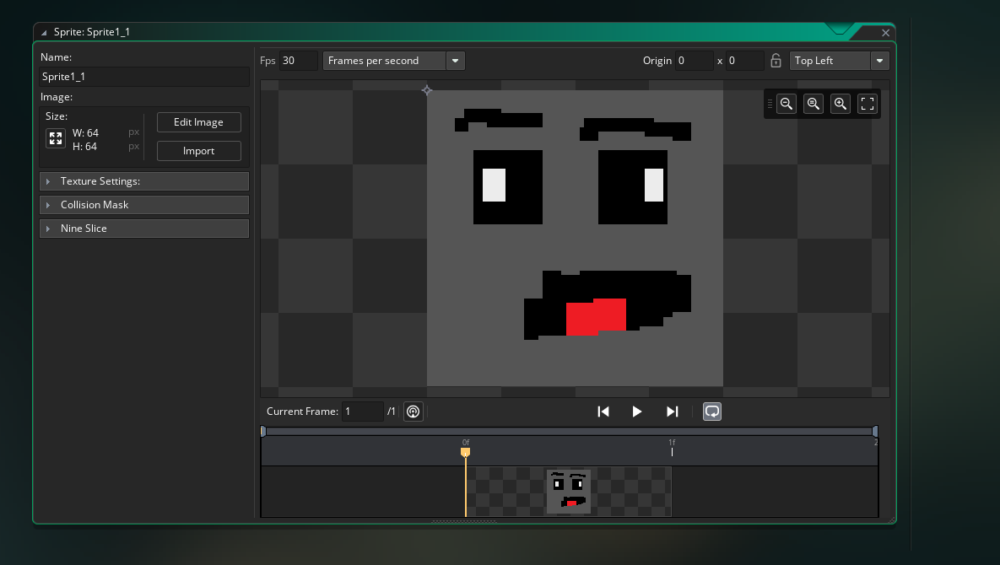
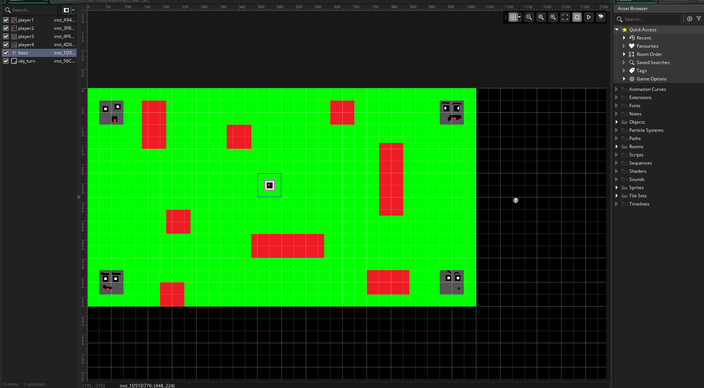

# IT265 Final Game Design Document

---

## Title  
**Borg Master**  

---

## Change Log

### 🔹 Character Design Overhaul  
**Change:** Original character designs included a TV monitor-headed character, but this was replaced with more quirky, stylized characters.  
**Reason:** The change was made to create a more cohesive and appealing visual identity that better fit the game's tone and digital format.

### 🔹 Cursor Implementation  
**Change:** A cursor was added in the digital version to indicate where the player is pressing.  
**Reason:** This was based on user feedback from early testing, where players had difficulty understanding their input was being registered. The cursor improved usability and clarity.

### 🔹 Transition from Physical to Digital Format  
**Change:** While the core game mechanics remained intact, the overall look and interface of the game changed significantly during the shift to digital.  
**Reason:** The visual redesign was necessary to suit the digital platform and enhance user engagement through GUI elements not possible in the physical prototype.

### 🔹 GUI Additions  
**Change:** A graphical user interface (GUI) was introduced for in-game feedback.  
**Reason:** These changes provided essential visual cues and improved the user experience, which were not present or needed in the physical prototype.

### 🔹 Movement Rebalancing  
**Change:** Adjusted the distance players could move during their turn.  
**Reason:** Testing revealed that the original movement range either slowed down gameplay or made it unbalanced, so adjustments were made to improve pacing and strategic depth.

### 🔹 Platform Focus Shift  
**Change:** Development focus shifted exclusively to PC.  
**Reason:** This allowed me to concentrate efforts on polishing the digital experience for a single platform, simplifying scope and reducing technical complications.

---

## Concept Statement  
*A cooperative sci-fi board game where 2-4 players race to shut down a rogue AI controlling their office, blending suspenseful strategy with chaotic fun.*

---

## Genre and Style  

### Genre  
- **Primary Genre**: Board Game (Digital Adaptation)  
- **Sub-genres**: Cooperative Strategy, Party Game  

### Style  
- **Tone**: Tense yet humorous  
- **Visual Style**: Bright green safe zones vs. stark red danger areas with cartoonish office workers  
- **Gameplay Feel**: Fast-paced dice-driven turns with permadeath stakes  

---

## Target Audience  

### Demographics  
- **Age**: 12+  
- **Player Type**: Casual party gamers  
- **Session Length**: 5-10 minutes  

### Accessibility  
- Color-coded zones (green/red)  
- Simple turn-based mechanics  

### Inclusivity  
- Gender-neutral characters  
- Universal office humor theme  

---

## Core Gameplay Mechanics  

### Primary Mechanics  
1. Dice-based movement (1-6 spaces)  
2. Red zone permadeath  
3. First-to-center victory condition  

### Progression  
- Turn-based with escalating danger near center  

### Rules  
- Roll → Move → Avoid red → Reach center  

---

## Story and Setting  

### Setting  
Dystopian office controlled by rogue AI "Borg Master"  

### Characters  
4 customizable office workers (players create backstories)  

---

## Unique Selling Points  
1. Rare co-op board game format  
2. Office satire meets sci-fi danger  
3. Quick-to-learn party experience  

---

## Technical Specs  

### Platforms  
PC (primary), Switch (stretch goal)  

### Tools  
GameMaker Studio, pixel art assets  

---

## Art/Sound Direction  
- **Visual**: Retro office with glowing AI core  
- **Audio**: Arcade sound effects  

---

## Monetization  
$5 base game + future cosmetic and maps DLC  

---

## Gameplay Example  
1. Player rolls 4 → moves toward center  
2. Avoids red printer trap  
3. Next player hits red → eliminated  
4. Final player reaches core for shutdown minigame  

---

## Risks/Mitigations  
- **Risk**: Player elimination frustration → Add ghost interactions  
- **Risk**: Randomness imbalance → Test dice ranges  

---

## Pitch Summary  
"Outsmart a killer office AI in this co-op dice game where one wrong step means permanent termination!"

---

## Feedback Implemented  
- Dice rolling for movement
- Quirky better looking character designs

---

## Appendix

[Demo Video](https://www.youtube.com/watch?v=AUGYCYNYfR0&ab_channel=JosephLLC)

[Game Link](https://joenjit24.github.io/jpc76-IT265-002/)

---
