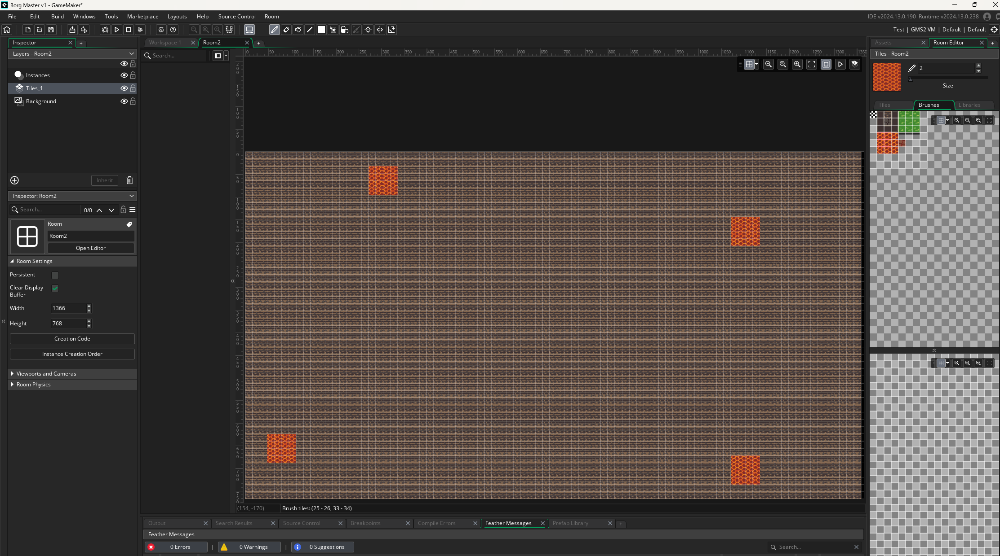

## Name: Joseph Conlon
### Module: 08

### Date: [04/14/2025]

#### Goals for this Module
- [x] Begin first map design for Borg Master.
- [x] Explore visual inspirations for assets.
- [x] Transition project to a game engine.

#### Progress
- **What I accomplished**:
  - Created a rough draft of the first map with placeholder tiles.
  - Switched over to GameMaker Studio and began working within its room and tile systems.
  - Browsed asset references online for game tone and style direction.

- **Challenges faced**:
  - Difficulty importing and managing tilesets in GameMaker Studio.
  - Brushing out the map layout while keeping it symmetrical and fair.
  - Familiarizing myself with the new interface and workflow after switching engines.

- **Solutions**:
  - Took time to study GameMaker’s tile system and experimented through trial and error.
  - Simplified the map to a grid-based structure to keep it organized and playable.
  - Used placeholder lava tiles to prototype obstacle placement and visual spacing.
    

#### Learnings
- Symmetry in map layout plays a big role in ensuring fairness for all players.
- Simpler grid-based maps can still offer a lot of strategy, especially in a 2–4 player game setting.
- Switching engines can feel overwhelming at first, but hands-on work accelerates the learning curve.

#### Free Thinking
- Lava tiles could evolve into various types of hazards or environmental effects.
- Potential to randomize obstacle placement in future versions for replayability.
- Consider implementing visual themes for different maps (e.g. lava zone, ice zone, tech zone).

#### Next Steps
- Complete or polish the working map with final tiles.
- Begin basic character sprite design and movement logic.
- Consider early implementation of player spawn points and collisions.
