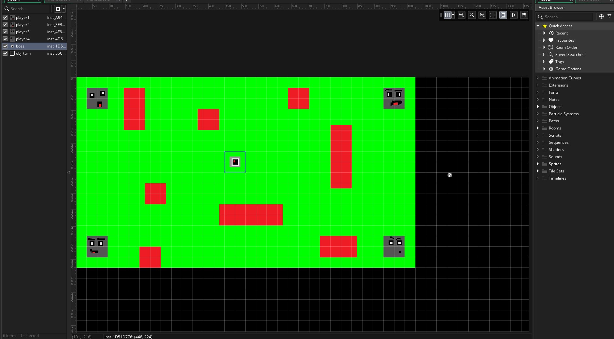

<!-- Markdown Docs: https://docs.github.com/en/get-started/writing-on-github/getting-started-with-writing-and-formatting-on-github/basic-writing-and-formatting-syntax -->
## Name: Joseph Conlon
### Module: 11

<!-- Repeat the below as needed-->
### Date: [05/09/2025]

#### Goals for this Module
- [x] Implement core dice-roll movement system  
- [x] Design office hazard (red zones)  
- [x] Create character selection UI  
- [x] Test permadeath mechanic with playtesters  

#### Progress
- **What I accomplished**:  
  - Finished complete demo with all core systems  
  - Added GUI for dice rolls and movement cursor (playtesters loved this!)  

- **Challenges faced**:  
  - Player elimination caused premature game endings  
  - Movement felt too loose/unpredictable  

- **Solutions**:  
  - Prototyped "ghost mode" where eliminated players can place minor traps  
  - Testing a "2-strike" system before permanent elimination  

#### Learnings
- Key insights:  
  - **Unexpected win**: Players enjoyed the slapstick GUI elements more than anticipated  
  - **Critical feedback**: Game needs more risk/reward decisions beyond "avoid red"  
  - **Tech discovery**: GameMaker's audio system requires optimization for Switch port  

#### Free Thinking
- **"What if hazards had escalating effects?"**  
  - First printer jam slows you, second destroys your next move  
- **"Could the AI taunt players?"**  
  - Add snarky computer voice lines when players fail ("Employee #3 terminated... like yesterday's coffee")  

#### Next Steps
1. **Audio**:  
   - Source office-themed SFX  
   - Compose 3 music tracks (menu, gameplay, victory)  

2. **Movement Tweaks**:  
   - Implement grid-snapping for stricter movement  
   - Test "card-based" movement as alternative to dice  

3. **New Mechanics**:  
   - Office supplies as power-ups (stapler teleport, chair shield)  
   - Late-game AI countermeasures (shifting red zones after turn 10)  

